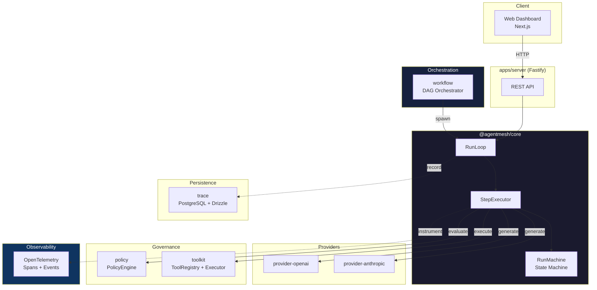
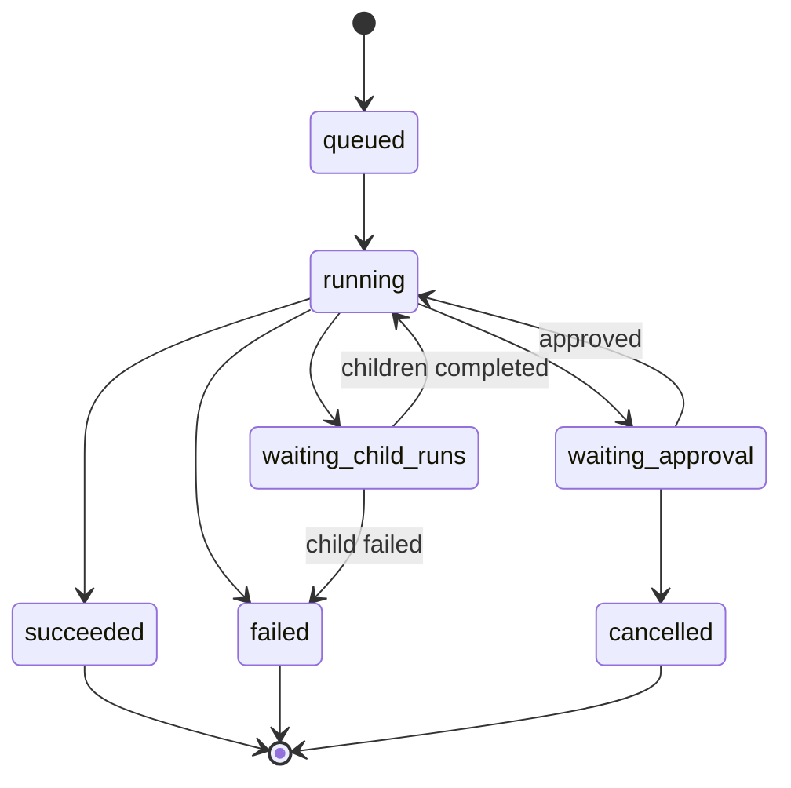
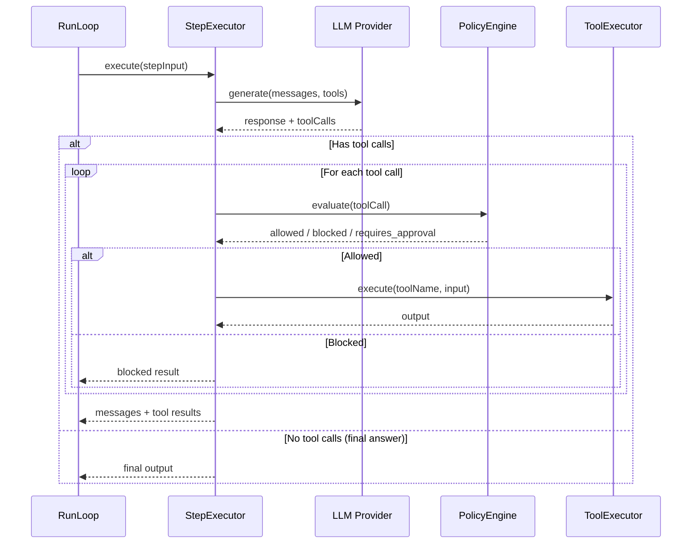
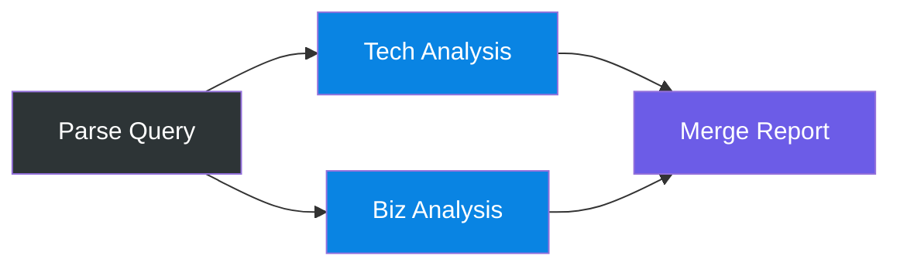

# agentmesh-ts

[](https://github.com/takish/agentmesh-ts/actions/workflows/ci.yml)


```
     █████╗  ██████╗ ███████╗███╗   ██╗████████╗
    ██╔══██╗██╔════╝ ██╔════╝████╗  ██║╚══██╔══╝
    ███████║██║  ███╗█████╗  ██╔██╗ ██║   ██║
    ██╔══██║██║   ██║██╔══╝  ██║╚██╗██║   ██║
    ██║  ██║╚██████╔╝███████╗██║ ╚████║   ██║
    ╚═╝  ╚═╝ ╚═════╝ ╚══════╝╚═╝  ╚═══╝   ╚═╝
              ███╗   ███╗███████╗███████╗██╗  ██╗
              ████╗ ████║██╔════╝██╔════╝██║  ██║
              ██╔████╔██║█████╗  ███████╗███████║
              ██║╚██╔╝██║██╔══╝  ╚════██║██╔══██║
              ██║ ╚═╝ ██║███████╗███████║██║  ██║
              ╚═╝     ╚═╝╚══════╝╚══════╝╚═╝  ╚═╝
```

> **Production-grade runtime for AI agents**
>
> Execute, trace, and govern AI agent workflows with typed tools, provider-agnostic orchestration, and policy-aware execution.

---

## What is this?

A TypeScript runtime that treats AI agent execution as a first-class engineering concern — not just "call LLM, parse output, loop."

Most agent frameworks focus on demos. AgentMesh focuses on what happens after the demo: traceability, governance, cost control, and reproducibility. Every step is recorded. Every tool call is validated. Every policy decision is auditable.

---

## Features

- **Provider-agnostic** — OpenAI, Anthropic. Same `LlmProvider` interface, swap freely.
- **Typed tool contracts** — Zod schemas for inputs/outputs, permission scopes, side-effect levels.
- **Step-level tracing** — Every LLM call, tool execution, and policy decision persisted as events.
- **Policy engine** — Cost budgets, tool allowlists, step limits, approval gates, dangerous action blocking.
- **Multi-agent workflows** — DAG-based orchestration with topological parallel execution.
- **OpenTelemetry** — Native span instrumentation across RunLoop, StepExecutor, LLM calls, and tool execution.
- **RunLoop abstraction** — Encapsulates the full agent execution lifecycle with budget enforcement.
- **Developer UI** — Dark-themed run timeline, cost tracking, JSON inspection.

---

## Architecture



---

## Packages

```
agentmesh-ts/
├── packages/
│   ├── core/                 # RunLoop, StepExecutor, RunMachine, domain events
│   ├── toolkit/              # defineTool(), ToolRegistry, ToolExecutor, built-in tools
│   ├── workflow/             # DAG validation, topological sort, WorkflowOrchestrator
│   ├── policy/               # PolicyEngine, rules (budget, allowlist, scope, danger)
│   ├── trace/                # Event persistence (PostgreSQL, Drizzle ORM)
│   ├── provider-openai/      # OpenAI adapter
│   ├── provider-anthropic/   # Anthropic adapter
│   ├── ui-contracts/         # Shared types for API ↔ UI
│   └── create-agentmesh/     # CLI setup wizard (create-agentmesh)
├── apps/
│   ├── server/               # Fastify REST API (port 3100)
│   └── web/                  # Next.js dashboard
└── examples/
    ├── research-agent/       # Web search → summarize
    ├── support-triage-agent/ # Classify → route → draft
    └── code-review-agent/    # Read diff → find issues
```

---

## Core Concepts

### Run Lifecycle

A **Run** is one agent execution. It has a goal, a provider, allowed tools, and policy constraints.



### RunLoop

The `RunLoop` encapsulates the full agent execution lifecycle — state machine transitions, budget enforcement, step iteration, and event emission.

```typescript
import { RunLoop } from "@agentmesh/core";

const loop = new RunLoop(
  {
    runId: "run_001",
    agentName: "research-agent",
    goal: "Summarize recent AI news",
    model: "gpt-4o",
    systemPrompt: "You are a research assistant.",
    budget: { maxSteps: 10, maxCostUsd: 0.50 },
  },
  { provider, toolHandler, policyChecker, onEvent: console.log },
);

const result = await loop.execute();
// → { status, output, messages, totalSteps, totalCostUsd, events, usage }
```

### StepExecutor

One unit of reasoning within a Run. Each step:

1. Calls the LLM with current messages and tool specs
2. If tool calls are returned, evaluates policy → executes tools → appends results
3. Returns updated messages, usage, and events

All steps are instrumented with OpenTelemetry spans.



### Tool

A typed, scoped capability the agent can invoke.

```typescript
import { defineTool } from "@agentmesh/toolkit";

const httpFetch = defineTool({
  name: "http_fetch",
  description: "Fetch a public HTTP resource",
  inputSchema: z.object({ url: z.string().url() }),
  outputSchema: z.object({ status: z.number(), body: z.string() }),
  permissionScope: "network:read",
  sideEffectLevel: "external_read",
  timeoutMs: 10_000,
  async execute(input) {
    const res = await fetch(input.url);
    return { status: res.status, body: await res.text() };
  },
});
```

**Built-in tools:** `webSearchTool`, `readFileTool`, `writeFileTool`, `httpFetchTool`, `runShellTool`

**Side-effect levels:** `read_only` → `external_read` → `external_write` → `system_mutation`

### Policy

Rules evaluated before every tool execution.

```typescript
// Built-in rules
import { CostBudgetRule, StepBudgetRule, ToolAllowlistRule } from "@agentmesh/policy";

const engine = new PolicyEngine([
  new CostBudgetRule(),
  new StepBudgetRule(),
  new ToolAllowlistRule(["http_fetch", "web_search"]),
]);
```

### Workflow Orchestrator

Multi-agent workflows defined as a DAG. Nodes within the same level execute in parallel.



```typescript
import { defineWorkflow, WorkflowOrchestrator } from "@agentmesh/workflow";

const wf = defineWorkflow("research-report")
  .node("parse",   { agentName: "parser",   goal: "Parse the query",                    model: "gpt-4o" })
  .node("tech",    { agentName: "tech",      goal: (i) => `Tech analysis: ${i.parse}`,   model: "gpt-4o" })
  .node("biz",     { agentName: "biz",       goal: (i) => `Biz analysis: ${i.parse}`,    model: "gpt-4o" })
  .node("merge",   { agentName: "merger",    goal: (i) => `Merge: ${i.tech} + ${i.biz}`, model: "gpt-4o" })
  .edge("parse", "tech")
  .edge("parse", "biz")
  .edge("tech",  "merge")
  .edge("biz",   "merge")
  .build();

const orchestrator = new WorkflowOrchestrator(wf, {
  resolveNodeDeps: createUniformDeps({ provider, toolHandler }),
  onEvent: console.log,
});

const result = await orchestrator.execute();
// Execution order: parse → [tech, biz] (parallel) → merge
```

### Trace

Immutable event log of everything that happened in a Run.

```
run.started → step.started → llm.called → llm.responded
  → tool.requested → policy.checked → tool.completed
  → step.completed → run.completed
```

---

## Quick Start

```bash
git clone https://github.com/takish/agentmesh-ts.git
cd agentmesh-ts
pnpm install
pnpm build

# Run an example
pnpm example:research
pnpm example:support-triage
pnpm example:code-review
```

### Interactive Setup

```bash
pnpm create agentmesh
```

---

## OpenTelemetry

Core execution is instrumented with `@opentelemetry/api`. When no `TracerProvider` is registered, all spans are no-ops with zero overhead.

**Span hierarchy:**

```
run.{agentName}                    # Root span per Run
├── step.{index}                   # One span per step
│   ├── llm.generate               # LLM call with model, tokens, finish_reason
│   ├── tool.{toolName}            # Tool execution with duration
│   └── [policy.checked]           # Span event for policy decisions
```

**Recorded attributes:**

| Span | Attributes |
|------|-----------|
| `run.*` | `run_id`, `agent_name`, `model`, `status`, `total_steps`, `total_cost_usd`, `input_tokens`, `output_tokens` |
| `step.*` | `run_id`, `step.index`, `model`, `finish_reason`, `blocked`, `tool_calls` |
| `llm.generate` | `model`, `input_tokens`, `output_tokens`, `finish_reason` |
| `tool.*` | `tool.name`, `tool.duration_ms` |

---

## API Endpoints

| Method | Path | Description |
|--------|------|-------------|
| `POST` | `/api/runs` | Create a new run |
| `GET` | `/api/runs` | List runs (filter by status, workflowId) |
| `GET` | `/api/runs/:id` | Run detail with steps |
| `GET` | `/api/runs/:id/events` | Event stream |
| `GET` | `/api/runs/:id/children` | Child runs |
| `POST` | `/api/runs/:id/approve` | Approve waiting run |
| `POST` | `/api/runs/:id/cancel` | Cancel run |
| `GET` | `/health` | Health check |

---

## Tech Stack

| Layer | Stack |
|-------|-------|
| **Runtime** | TypeScript 5.8, Node.js 18+, Zod |
| **API** | Fastify, Pino |
| **Persistence** | PostgreSQL, Drizzle ORM |
| **Web UI** | Next.js, React 19, Tailwind CSS, shadcn/ui |
| **Monorepo** | pnpm workspaces, Turborepo |
| **Testing** | Vitest |
| **Observability** | OpenTelemetry |
| **LLM Providers** | OpenAI SDK, Anthropic SDK |

---

## Roadmap

See [Issues](https://github.com/takish/agentmesh-ts/issues) for details.

| Version | Focus | Status |
|---------|-------|--------|
| **v0.1** | Core runtime, providers, tools, policy, persistence, API, Web UI | Done |
| **v0.2** | RunLoop abstraction, multi-agent workflows, OpenTelemetry, parent-child runs | Done |
| **v0.3** | Queue worker, distributed runs, MCP adapter, hosted mode | Planned |

---

## Design Principles

- **Explicit over implicit** — No magic. Every behavior is traceable.
- **Replayability first** — If you can't replay it, you can't debug it.
- **Tools are contracts** — Schema in, schema out. No stringly-typed APIs.
- **Providers are replaceable** — Business logic doesn't know about OpenAI vs Anthropic.
- **Traces are first-class** — Not an afterthought. The core data model.

---

## License

MIT
